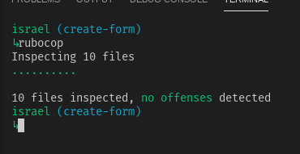

<!-- PROJECT SHIELDS -->
<!--
*** I'm using markdown "reference style" links for readability.
*** Reference links are enclosed in brackets [ ] instead of parentheses ( ).
*** See the bottom of this document for the declaration of the reference variables
*** for contributors-url, forks-url, etc. This is an optional, concise syntax you may use.
*** https://www.markdownguide.org/basic-syntax/#reference-style-links
-->

[![Contributors][contributors-shield]][contributors-url]
[![Forks][forks-shield]][forks-url]
[![Stargazers][stars-shield]][stars-url]
[![Issues][issues-shield]][issues-url]
[![MIT License][license-shield]][license-url]

<!-- PROJECT LOGO -->
 

  

  <h3 align="center">
    Project 1: Bare Metal Forms and Helpers
  </h3>

  

    This is part of the Forms Project in The Odin Project’s Ruby on Rails Curriculum.  
     
    <a href="https://github.com/raheebwa/bare-metal-forms/blob/master/README.md"><strong>Explore the docs �</strong></a>
     
     
    🖊️
    <a href="https://www.theodinproject.com/courses/ruby-on-rails/lessons/forms">Assigment</a>
    🐛
    <a href="https://github.com/raheebwa/bare-metal-forms/issues">Report Bug</a>
    🙏
    <a href="https://github.com/raheebwa/bare-metal-forms/issues">Request Feature</a>
  

# Getting Your Feet Wet

Implement a version of Ruby’s enumerable methods.

[live version](https://toy-app-arir.herokuapp.com)

# Validations

Rubocop:

# Features

- Using different databases for development (sqlite3) and production (postgres)
- Followed the tutorial
- Tests made with [`RSpec`](https://relishapp.com/rspec/)

# Built With

- `ruby` v2.5.5
- `rails` v5.2.3+
- RVM
- `vscode` with _Ruby_ and _Rubocop_ extensions
- Linux
- Love and Passion for code.

# Authors

- [Aheebwa Ramadhan](https://github.com/raheebwa)
- [Israel Laguan](https://github.com/Israel-Laguan)

# License

This project is licensed under the MIT License - see the [LICENSE.md](LICENSE.md) file for details

<!-- ACKNOWLEDGEMENTS -->

## Acknowledgements

- [Microverse](https://www.microverse.org/)
- [The Odin Project](https://www.theodinproject.com/)
- [Readme header](https://github.com/collinsugwu/Microverse201-Enumerable-Methods)

<!-- MARKDOWN LINKS & IMAGES -->
<!-- https://www.markdownguide.org/basic-syntax/#reference-style-links -->

[contributors-shield]: https://img.shields.io/github/contributors/raheebwa/bare-metal-forms.svg?style=flat-square
[contributors-url]: https://github.com/raheebwa/bare-metal-forms/graphs/contributors
[forks-shield]: https://img.shields.io/github/forks/raheebwa/bare-metal-forms
[forks-url]: https://github.com/raheebwa/bare-metal-forms/network/members
[stars-shield]: https://img.shields.io/github/stars/raheebwa/bare-metal-forms
[stars-url]: https://github.com/raheebwa/bare-metal-forms/stargazers
[issues-shield]: https://img.shields.io/github/issues/raheebwa/bare-metal-forms
[issues-url]: https://github.com/raheebwa/bare-metal-forms/issues
[license-shield]: https://img.shields.io/github/license/raheebwa/bare-metal-forms
[license-url]: https://github.com/raheebwa/bare-metal-forms/blob/master/LICENSE.txt
